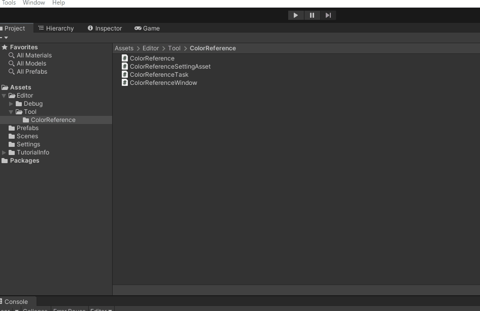

# UnityMockTools

個人制作をしていく中で便利そうだと感じた物をまとめたプロジェクトです。

忘備録及び自主学習を目的に更新しています。

| 管理者        | MASAKI SHIMURA |
|------------|----------------|
| Unityバージョン | 2021.3.34f1      |


# 〇 フィルダ構成

UntyPackageでインストールする場合に必要なファイルを選別しやすくできる事をコンセプトにしています。

| MSApp | アプリケーションでも使う事が想定出来る物 |
|-------|----------------------|
| MSLib | アプリケーションに含めずエディタ関連の物 |


```markdown
├─MSApp
│  ├─Editor
│  │  └─Tests
│  │      └─File
│  └─Scripts
│      └─File
├─MSLib
   └─Editor
       ├─EditorWindowTask
       ├─Tests
       └─Tools //ツール毎にファイリングしています
           ├─ColorReference
           ├─CreateTemplatePrefab
           ├─FileFocus
           ├─ReferenceURL
           └─UnitTestEditor
```


# 〇 デバック機能 紹介

## ■ フォルダのフォーカス機能
エディターウィンドウでボタンを押すと「Project Window」の特定の階層をフォーカスしてくれるデバック機能です。

※補足…「EditorFilePaths」のアセットデータにファイルパスを指定指定出来ます。


## ■ テンプレートプレハブの生成機能

エディターウィンドウから特定のプレハブを生成する機能です。


## ■ カラーリファレンス機能

カラー情報を資料として記録させるデバックウィンドウです。



## ■ 単体テスト実行ウィンドウ

単体テストをエディタウィンドウから実行する機能です。


## ■ URLレファレンス

各種URLを事前に登録しておく事でエディタウィンドウから簡易的に開く事が出来る機能。


## ■ スタートアップウィンドウ

UnityEditorを起動した時に開くウィンドウ
※必要に応じてカスタマイズしてください。


