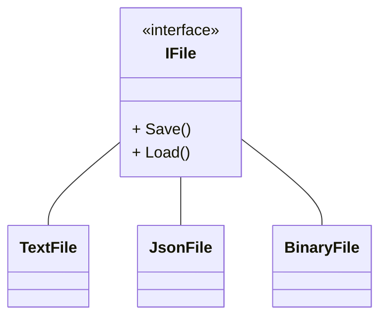

# File クラスの構成メモ

```mermaid
classDiagram
    IFile--TextFile
    IFile--JsonFile
    IFile--BinaryFile
    class IFile{
        <<interface>>
        + Save()
        + Load()
    }
    class TextFile
    class JsonFile
    class BinaryFile
```